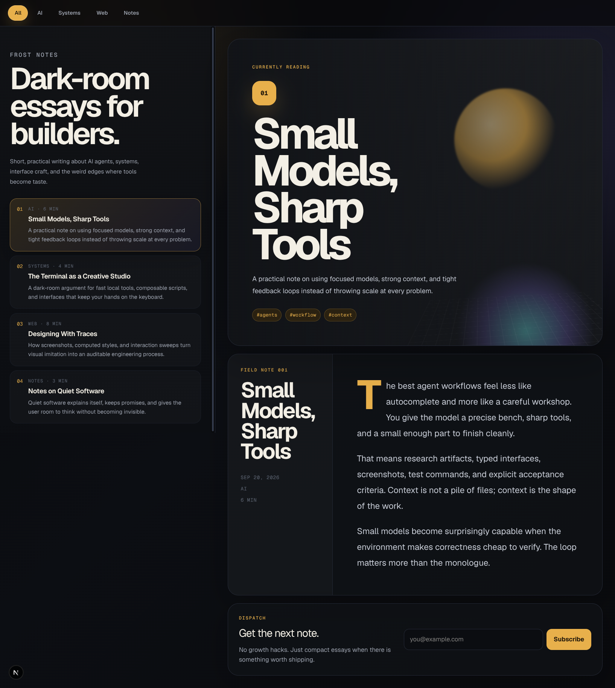

# Frost Notes

A polished dark-mode editorial blog built with **Next.js 16**, **React 19**, **TypeScript**, and **Tailwind CSS v4**. Frost Notes is designed as a compact publishing surface for essays about AI agents, systems, interface craft, and builder culture.



## Overview

Frost Notes is a single-page, app-router blog experience with a strong editorial layout: a sticky category rail, selectable article cards, an atmospheric featured story panel, a focused article reader, and a newsletter callout. The current content is static and local, making the project fast to run, easy to customize, and ready to evolve into a CMS-backed or MDX-powered site later.

The design direction is intentionally cinematic: deep charcoal panels, warm gold accents, radial ambient lighting, oversized editorial typography, and subtle glassy surfaces.

## Highlights

- **Dark-first editorial interface** with a premium visual system
- **Interactive category filtering** for AI, Systems, Web, and Notes
- **Selectable posts** with synchronized feature panel and article reader
- **Responsive layout** that shifts from a two-column desktop shell to stacked mobile cards
- **Local variable fonts** via bundled Geist Sans and Geist Mono assets
- **TypeScript-first data model** for posts and categories
- **Production-ready Next.js app router setup**
- **Docker support** inherited from the project scaffold
- **Clean static demo behavior** with no backend requirement

## Tech Stack

| Layer | Technology |
|---|---|
| Framework | Next.js 16 App Router |
| Runtime UI | React 19 |
| Language | TypeScript strict mode |
| Styling | Tailwind CSS v4 + custom CSS tokens |
| UI Utilities | shadcn-style setup, `cn()` utility, `class-variance-authority` |
| Fonts | Local Geist Variable + Geist Mono Variable |
| Deployment Target | Vercel, Docker, or any Node-compatible host |

## Project Structure

```txt
frost-notes/
├── src/
│   ├── app/
│   │   ├── globals.css      # Theme tokens, layout, responsive styling
│   │   ├── layout.tsx       # Metadata, favicon, root document
│   │   └── page.tsx         # Blog UI, post data, interactions
│   ├── components/ui/       # shadcn-style UI primitives
│   └── lib/utils.ts         # cn() helper
├── public/
│   └── fonts/               # Bundled Geist font files
├── docs/
│   ├── design-references/   # Screenshots and visual references
│   └── research/            # Design tokens, topology, behavior notes
├── Dockerfile
├── docker-compose.yml
├── package.json
└── README.md
```

## Core Components

The primary blog experience lives in `src/app/page.tsx`.

### `BlogNav`

Sticky category navigation. Filters visible posts by category and resets the active article to the first matching post.

### `PostList`

Left-side editorial rail containing the brand statement and selectable post cards. On desktop it stays sticky; on smaller screens it becomes a normal stacked content section.

### `FeaturedPanel`

Large atmospheric hero card for the active post. Uses pure CSS gradients, orbs, and a perspective grid plane — no image dependency required.

### `Article`

Focused reader panel with metadata, large title treatment, article body copy, and a drop-cap first paragraph.

### `NewsletterCard`

Static subscription callout. The form currently prevents default submission and is ready to connect to an email provider later.

## Getting Started

### Prerequisites

- Node.js `>=24`
- npm

The repo includes an `.nvmrc` with the intended Node major version:

```bash
nvm use
```

### Install

```bash
npm ci
```

### Run locally

```bash
npm run dev
```

Open:

```txt
http://localhost:3000
```

### Production build

```bash
npm run build
npm run start
```

### Full project check

```bash
npm run check
```

This runs linting, TypeScript validation, and a production build.

## Available Scripts

| Command | Description |
|---|---|
| `npm run dev` | Start the Next.js development server |
| `npm run build` | Create a production build |
| `npm run start` | Start the production server |
| `npm run lint` | Run ESLint |
| `npm run typecheck` | Run TypeScript with `--noEmit` |
| `npm run check` | Run lint, typecheck, and build |

## Customizing Content

Posts are currently defined as static data in `src/app/page.tsx`:

```ts
type Post = {
  slug: string;
  title: string;
  eyebrow: string;
  date: string;
  readTime: string;
  category: Exclude<Category, "All">;
  excerpt: string;
  body: string[];
  tags: string[];
  accent: string;
};
```

To add a post:

1. Add a new object to the `posts` array.
2. Choose one of the existing categories or add a new value to `categories`.
3. Add body paragraphs to the `body` array.
4. Add tags for the featured panel.

For a larger blog, the next natural step is moving this content to MDX, Contentlayer, a headless CMS, or a file-based content directory.

## Customizing the Theme

The visual system is centralized in `src/app/globals.css` under `:root` CSS variables:

```css
:root {
  --bg: #08090b;
  --panel: #101216;
  --ink: #f3efe5;
  --muted: #9ba1ad;
  --accent: #e8b04b;
  --accent-soft: #2a2111;
}
```

Adjust these variables to quickly reskin the site while preserving the layout and component structure.

Key design tokens:

- `--accent` controls the gold highlights, active pills, tags, and buttons.
- `--panel` and `--raised` control card depth.
- `--line` and `--line-soft` control border contrast.
- `--violet` and `--cyan` power the atmospheric hero glow.

## Deployment

### Vercel

This is a standard Next.js app and can be deployed directly to Vercel.

```bash
npm run build
```

Then connect the repository in Vercel and use the default Next.js settings.

### Docker

The repository includes Docker support:

```bash
docker compose up app --build
```

For development mode:

```bash
docker compose up dev --build
```

## Roadmap Ideas

- Add MDX-backed posts
- Add individual routes for each article
- Add RSS feed generation
- Add SEO/Open Graph images per post
- Connect newsletter form to Buttondown, Resend, ConvertKit, or a custom endpoint
- Add search and keyboard shortcuts
- Add syntax-highlighted code blocks
- Add reading progress and table of contents
- Add light/dark theme toggle while keeping dark as default

## Quality Status

Validated with:

```bash
npm run lint
npm run typecheck
npm run build
```

## License

MIT
